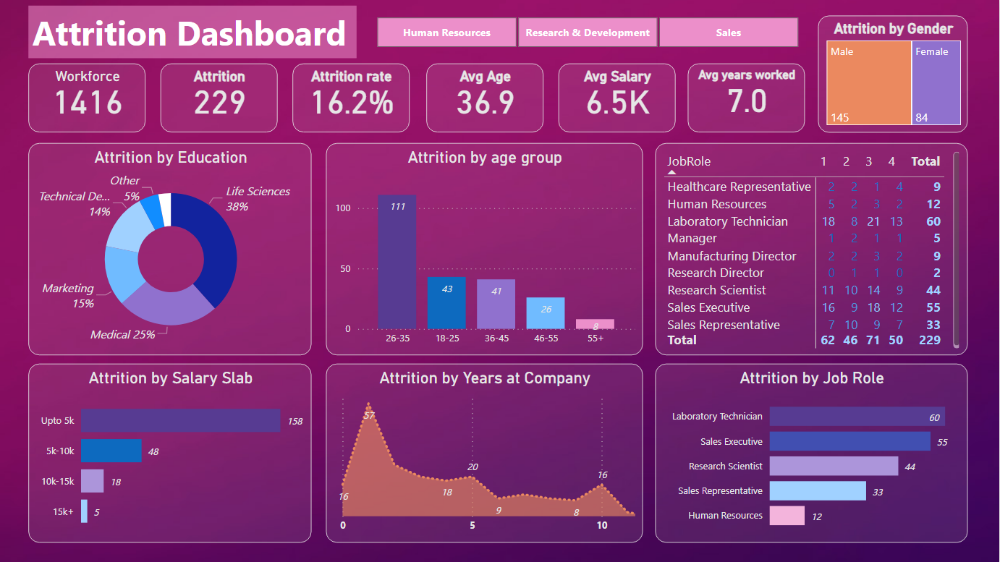

# HR-Dashboard
Attrition (departure of employees from organization) analytics dashboard on <b>PowerBI</b>.  
For a better experience, view on the PowerBI website <a href="https://app.powerbi.com/groups/me/reports/88062cb4-041f-49a3-9d3a-5a10b3bb9384/ReportSection?experience=power-bi">here</a>.

# Dashboard Overview
  
The dashboard displays the slicers based on department of the employees along with a tree map representing the gender ratio of the departed employees on the very top. Following these are the KPIs used for the creation of the subsequent visualizations. All of these visualizations are entirely dynamic when opened on PowerBI, displaying the KPIs and other visualizations based on the selected sub-category.

## Dataset
The dataset included in this repo was downloaded from <a href='https://www.youtube.com/watch?v=j4xlVLgsmNQ'>this</a> video.  
Following are some details about the dataset, with focus on the KPIs used:
<table>
  <tr>
    <th align="left">
      <b>Attribute
    </th>
    <th align="left">
      <b>Description
    </th>
  </tr>
  <tr>
    <td>
      EmpID
    </td>
    <td>
      Employee ID of the individual
    </td>
  </tr>
  <tr>
    <td>
      Age
    </td>
    <td>
      Age of the employee
    </td>
  </tr>
  <tr>
    <td>
      AgeGroup
    </td>
    <td>
      Age grouped into the groups 18-25, 26-35 ... 55+
    </td>
  </tr>
  <tr>
    <td>
      Attrition
    </td>
    <td>
      Wheteher or not the employee has departed
    </td>
  </tr>
  <tr>
    <td>
      EducationField
    </td>
    <td>
      Field of Education of the employee
    </td>
  </tr>
  <tr>
    <td>
      Gender
    </td>
    <td>
      Gender of the employee
    </td>
  </tr>
  <tr>
    <td>
      JobRole
    </td>
    <td>
      Field of the job of the employee
    </td>
  </tr>
  <tr>
    <td>
      JobSatisfaction
    </td>
    <td>
      Scale of 1-4
    </td>
  </tr>
  <tr>
    <td>
      MonthlyIncome
    </td>
    <td>
      Salary of the individual, monthwise
    </td>
  </tr>
  <tr>
    <td>
      SalarySlab
    </td>
    <td>
      Upto 5k, 5k-10k, 10k-15k, 15k+
    </td>
  </tr>
  <tr>
    <td>
      YearsAtCompany
    </td>
    <td>
      Total number of years employee has/had worked at the company
    </td>
  </tr>
</table>
 
This dataset was cleaned using PowerBI transform tool prior to creation of the dataset to exclude any duplicate, null-valued and erroneous rows. Some columns were also altered by changing the datatype and to remove any redundancies while creating the dataset to ensure the dashboard was created without any discrepancies.
 
<h2>Dataset link(CSV): <a href="https://drive.google.com/file/d/17I_OcgqQKdyZmViYDaDFtN_QlFCfREDf/view?usp=drive_link">HR_Analytics.csv</a></h2>
